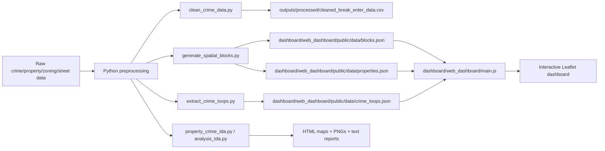
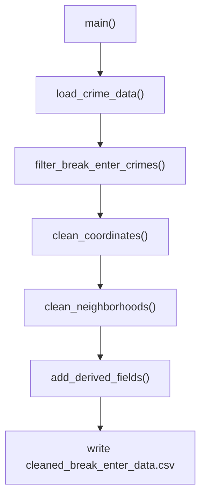
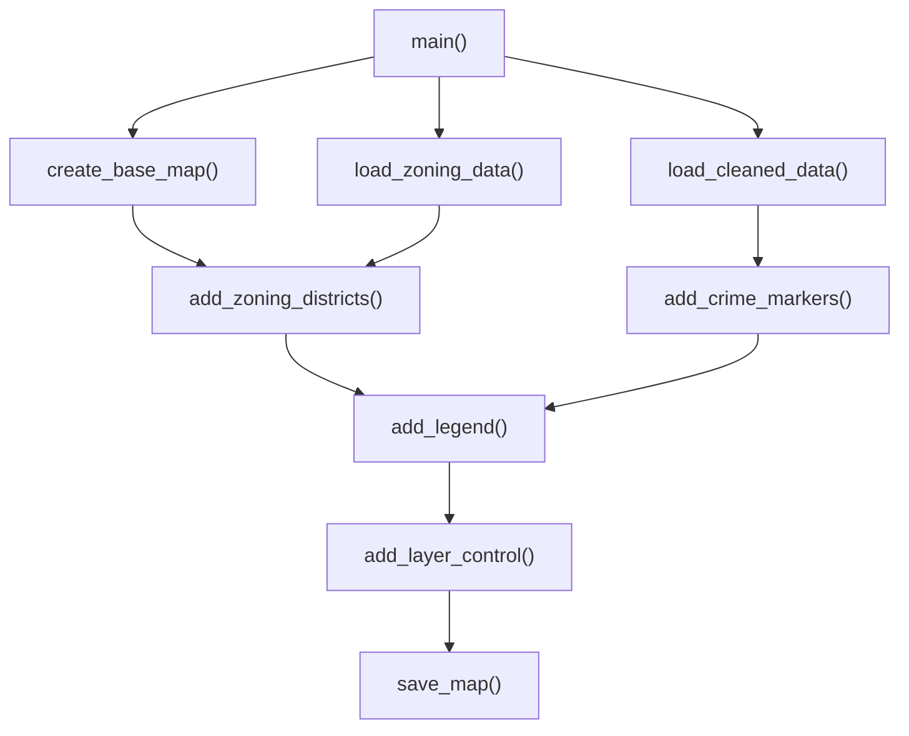
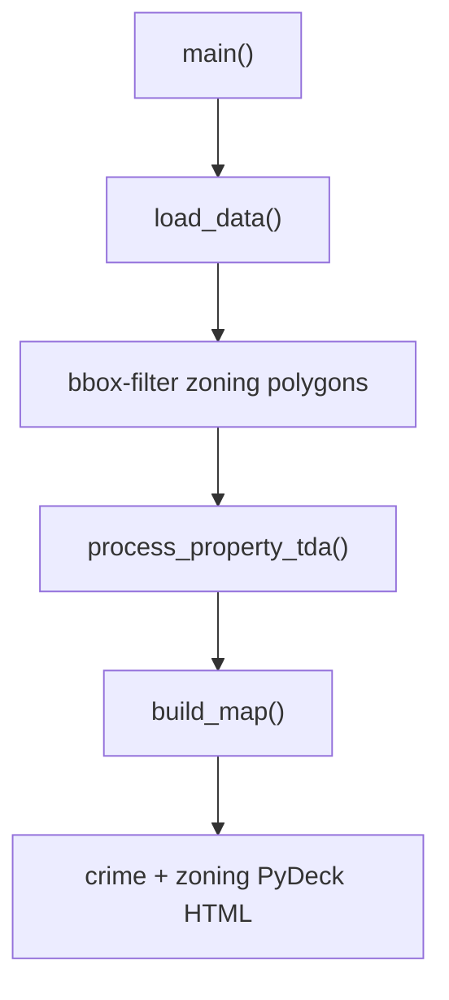
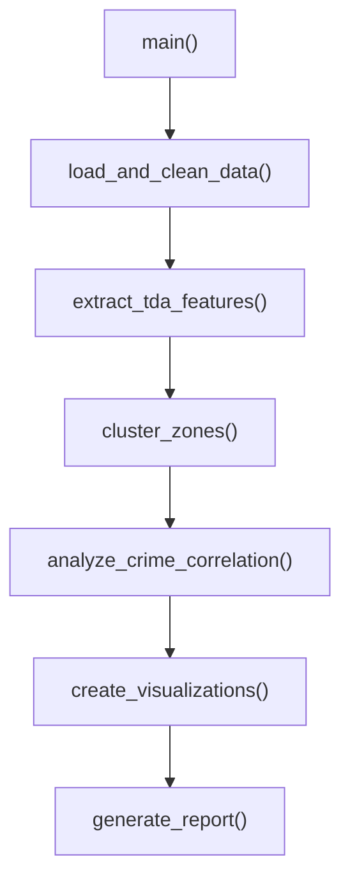
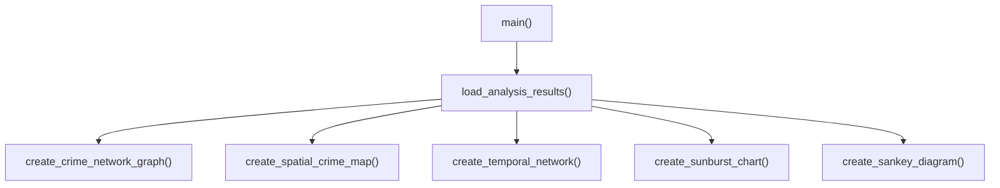
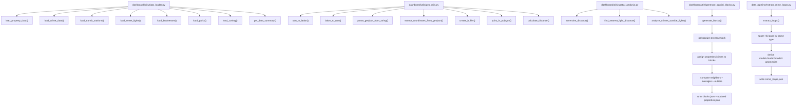
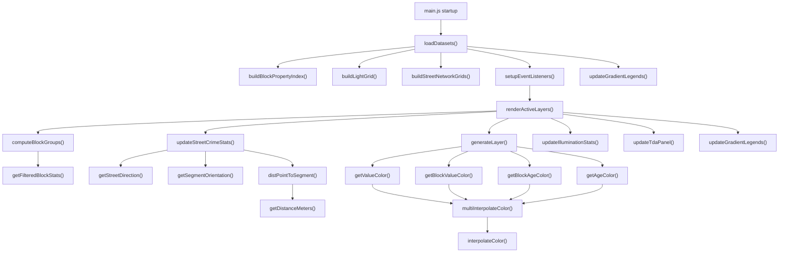
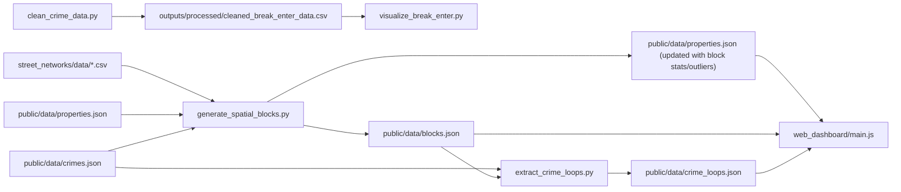

# Codebase Function Hierarchy And Flow

## What This Repository Does

This project analyzes Vancouver urban data with a strong focus on crime, property values, zoning, lighting, transit, and street structure.

It has two main halves:

1. Python scripts that clean data, run analysis, generate topology-driven features, and export visualization-ready artifacts.
2. A static web dashboard that loads precomputed GeoJSON/JSON files and renders them interactively in the browser with Leaflet.

## High-Level File Hierarchy

```mermaid
flowchart TD
    A["Repository"] --> B["src/"]
    A --> C["dashboard/utils/"]
    A --> D["dashboard/web_dashboard/"]
    A --> E["data_pipeline/"]
    A --> F["street_networks/"]
    A --> G["Data/ + outputs/ + visualizations/"]

    B --> B1["clean_crime_data.py"]
    B --> B2["visualize_break_enter.py"]
    B --> B3["analysis_tda.py"]
    B --> B4["property_crime_tda.py"]
    B --> B5["create_network_visuals.py"]

    C --> C1["data_loader.py"]
    C --> C2["geo_utils.py"]
    C --> C3["spatial_analysis.py"]
    C --> C4["generate_spatial_blocks.py"]
    C --> C5["geocode_properties.py"]
    C --> C6["export_street_network.py"]

    D --> D1["index.html"]
    D --> D2["style.css"]
    D --> D3["main.js"]
    D --> D4["public/data/*.json"]

    E --> E1["extract_crime_loops.py"]

    F --> F1["visualize_network.py"]
    F --> F2["data/junctions.csv"]
    F --> F3["data/segments.csv"]
```

## Pipeline Diagram

## Main Python Scripts

### 1. `src/clean_crime_data.py`

Purpose:
- Loads the Vancouver crime CSV.
- Keeps only break-and-enter incidents.
- Removes unusable coordinates such as `(0, 0)`.
- Removes missing neighborhoods.
- Adds a simpler `CRIME_CATEGORY` field.
- Saves a cleaned dataset for later mapping.

### 2. `src/visualize_break_enter.py`

Purpose:
- Converts UTM crime coordinates into latitude/longitude.
- Loads zoning polygons.
- Builds a Folium map.
- Draws zoning districts and crime points as separate layers.
- Exports an interactive HTML map.

### 3. `src/analysis_tda.py`

Purpose:
- A simpler TDA prototype.
- Loads crime, zoning, and property records.
- Computes persistence-based complexity metrics for each zoning district.
- Builds a PyDeck 3D map with crime points and extruded zoning polygons.

### 4. `src/property_crime_tda.py`

Purpose:
- This is the most complete analysis script in `src/`.
- Loads crimes, zoning polygons, and property tax data.
- Builds topological features from property distributions plus zone shape metrics.
- Clusters zoning districts with DBSCAN.
- Counts crimes inside each zone.
- Produces a 3D map, charts, correlation heatmap, and text report.

### 5. `src/create_network_visuals.py`

Purpose:
- Builds secondary visual summaries from crime data.
- Produces:
- a crime co-occurrence network,
- a 3D spatial-time scatter plot,
- an hour-vs-crime bipartite network,
- a sunburst chart,
- and a Sankey diagram.

## Dashboard Utility Layer

## Web Dashboard Function Hierarchy

## Dashboard Logic Explained

### `loadDatasets()`
- Fetches all JSON and GeoJSON files from `public/data/`.
- Stores them in the global `state`.
- Precomputes dynamic min/max values for map legends.
- Builds indexes so later interactions stay fast.

### `buildBlockPropertyIndex()` and `getFilteredBlockStats()`
- Group property values and ages by `block_id`.
- Recompute a filtered mean using a standard deviation threshold.
- This powers block coloring, outlier logic, and tooltips.

### `computeBlockGroups()`
- Optionally merges nearby block averages into value bands.
- This is not geometry merging; it is display grouping by similar averages.

### `buildLightGrid()`
- Stores street lights in a spatial grid for fast “crime near a light?” checks.

### `buildStreetNetworkGrids()` and `updateStreetCrimeStats()`
- Indexes street segments and intersections in grid cells.
- For each active crime point, finds the nearest street segment.
- Aggregates counts so streets can be colored by crime intensity.

### `generateLayer()`
- Creates the correct Leaflet layer for each dataset.
- Handles custom behavior for:
- property dots,
- street lights,
- transit icons,
- blocks,
- crimes,
- street network,
- and TDA loop overlays.

### `renderActiveLayers()`
- Central render loop of the dashboard.
- Clears old layers.
- Recomputes any derived state needed by current settings.
- Creates layers in z-order.
- Updates statistics cards, legends, lighting stats, and the TDA side panel.

### `setupEventListeners()`
- Connects all checkboxes, sliders, and radio buttons to state changes.
- Most interactions eventually call `renderActiveLayers()`.

### `updateTdaPanel()`
- Reads `crime_loops.json`.
- Filters loops by currently active crime type.
- Compares loop-adjacent block values or ages against citywide values.
- Generates the explanatory sidebar content for the topological layer.

## Important Cross-File Connections

## In Plain English

The codebase is building a spatial research workflow:

- It starts by cleaning and transforming city datasets.
- It converts raw points and polygons into map-ready data.
- It creates derived spatial units called blocks using the street network.
- It attaches properties and crimes to those blocks.
- It uses topological data analysis to measure structure and irregularity in both property distributions and crime patterns.
- It exports those results into a browser-based dashboard where the user can filter layers, inspect outliers, compare blocks, and explore TDA crime loops interactively.

## Notable Design Pattern

The repository is mostly “precompute in Python, explore in JavaScript”:

- Python does expensive data cleaning, geometry handling, topological analysis, and artifact generation.
- The browser only loads prepared JSON and focuses on fast interaction, filtering, coloring, and tooltip/stat rendering.
